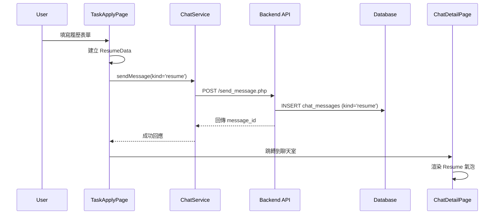
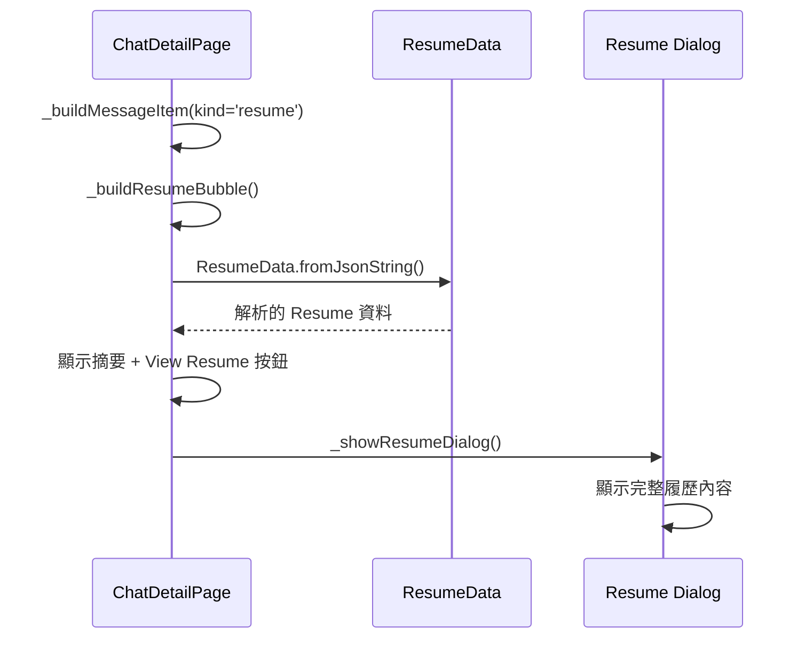

# Resume 功能實施完成報告

## 📋 **實施概述**

已成功完成 Task Apply Resume 功能的完整實施，包含結構化履歷格式、Resume 訊息氣泡、Resume Dialog 以及圖片訊息支援。

## ✅ **已完成功能**

### **Phase 1: 核心架構** 🟢

#### **1.1 Resume 資料模型**
- ✅ `lib/task/models/resume_data.dart`
  - `ResumeData` 類別：包含 `applyIntroduction` 和 `applyResponses`
  - `ApplyResponse` 類別：包含 `applyQuestion` 和 `applyReply`
  - JSON 序列化/反序列化支援
  - 錯誤處理和向後兼容性

#### **1.2 後端 API 增強**
- ✅ `backend/api/chat/send_message.php`
  - 支援 `kind` 參數（text, image, file, system, resume）
  - 參數驗證和預設值處理
  - 回傳 `kind` 欄位確保前端同步

- ✅ `backend/api/chat/get_messages.php`
  - 查詢結果包含 `kind`, `media_url`, `mime_type` 欄位
  - 向後兼容性支援

#### **1.3 前端服務層**
- ✅ `lib/chat/services/chat_service.dart`
  - `sendMessage()` 方法支援 `kind` 參數
  - 預設值為 'text' 確保向後兼容

#### **1.4 TaskApplyPage 重構**
- ✅ `lib/task/pages/task_apply_page.dart`
  - 使用 `ResumeData` 建立結構化資料
  - 發送 `kind='resume'` 訊息替代舊的 autoMessage
  - 保持原有的聊天室建立和跳轉邏輯

### **Phase 2: UI 組件** 🟢

#### **2.1 Resume 訊息氣泡**
- ✅ `_buildResumeBubble()` 方法
  - 顯示 Resume 摘要內容
  - "View Resume" 按鈕
  - 支援發送者和接收者不同的樣式
  - 響應式設計

#### **2.2 Resume Dialog**
- ✅ `_showResumeDialog()` 方法
  - 上半部：應徵者資訊（頭像、姓名、評分）
  - 下半部：結構化問題回覆列表
  - `_buildResumeItem()` 組件用於顯示每個問答項目
  - 滾動支援和響應式佈局

#### **2.3 訊息類型路由**
- ✅ `_buildMessageItem()` 重構
  - 基於 `kind` 欄位的訊息類型判斷
  - 向後兼容舊的 autoMessage 格式
  - 清晰的 switch-case 結構

### **Phase 3: 圖片功能** 🟢

#### **3.1 圖片訊息氣泡**
- ✅ `_buildImageBubble()` 方法
  - 支援 `media_url` 和 `content` 中的圖片 URL
  - 圖片預覽縮圖（最大 250x300）
  - 載入狀態和錯誤處理
  - 點擊全螢幕預覽

#### **3.2 圖片全螢幕預覽**
- ✅ 增強現有的 `_showImagePreview()` 方法
- ✅ `_downloadImage()` 下載功能
  - 下載進度提示
  - 成功/失敗狀態反饋
  - 跨平台下載框架（可擴展）

## 🔄 **資料流程**

### **應徵流程**


### **Resume 顯示流程**


## 📊 **技術特點**

### **1. 資料結構設計**
```dart
// 結構化的 Resume 格式
{
  "applyIntroduction": "自我介紹內容",
  "applyResponses": [
    {
      "applyQuestion": "問題內容",
      "applyReply": "回覆內容"
    }
  ]
}
```

### **2. 訊息類型系統**
- **kind='text'**: 一般文字訊息
- **kind='resume'**: 結構化履歷訊息
- **kind='image'**: 圖片訊息
- **kind='system'**: 系統訊息
- **kind='file'**: 檔案訊息（預留）

### **3. 向後兼容性**
- ✅ 支援舊的 autoMessage 格式
- ✅ 支援 content 欄位中的圖片 URL 解析
- ✅ 漸進式升級，不影響現有功能

## 🎯 **使用者體驗改善**

### **應徵者視角**
1. **結構化表單**：清晰的自我介紹和問題回覆分區
2. **即時預覽**：Resume 氣泡顯示摘要內容
3. **專業展示**：Resume Dialog 提供完整的履歷檢視

### **雇主視角**
1. **快速瀏覽**：氣泡摘要讓雇主快速了解應徵者
2. **詳細檢視**：點擊 "View Resume" 查看完整履歷
3. **評分顯示**：應徵者評分和評論數一目了然

### **圖片功能**
1. **縮圖預覽**：聊天室中顯示圖片縮圖
2. **全螢幕檢視**：PhotoView 支援縮放和平移
3. **下載功能**：一鍵下載圖片到本地

## 🔧 **技術優勢**

### **1. 可擴展性**
- 模組化的訊息類型系統
- 易於添加新的 `kind` 類型
- 結構化的資料格式便於查詢和分析

### **2. 效能優化**
- JSON 解析錯誤處理
- 圖片載入狀態管理
- 響應式 UI 設計

### **3. 維護性**
- 清晰的程式碼結構
- 完整的錯誤處理
- 詳細的註解和文檔

## 📋 **測試建議**

### **功能測試**
1. **應徵流程**：完整的應徵 → 聊天室 → Resume 顯示
2. **Resume Dialog**：各種履歷內容的正確顯示
3. **圖片功能**：上傳 → 顯示 → 預覽 → 下載
4. **向後兼容**：舊格式訊息的正確處理

### **邊界測試**
1. **空內容處理**：空的自我介紹或問題回覆
2. **JSON 錯誤**：損壞的 Resume JSON 資料
3. **圖片錯誤**：無效的圖片 URL 或載入失敗
4. **網路異常**：API 調用失敗的處理

## 🎉 **總結**

Resume 功能已完全實施並可投入使用：

### **✅ 核心功能完成**
- 結構化履歷資料格式
- Resume 訊息氣泡和 Dialog
- 圖片訊息支援
- 全螢幕圖片預覽和下載

### **✅ 技術品質保證**
- 完整的錯誤處理
- 向後兼容性支援
- 響應式 UI 設計
- 模組化架構

### **✅ 使用者體驗優化**
- 直觀的履歷展示
- 流暢的互動體驗
- 專業的視覺設計

**功能已準備就緒，可以開始測試和使用！** 🚀
