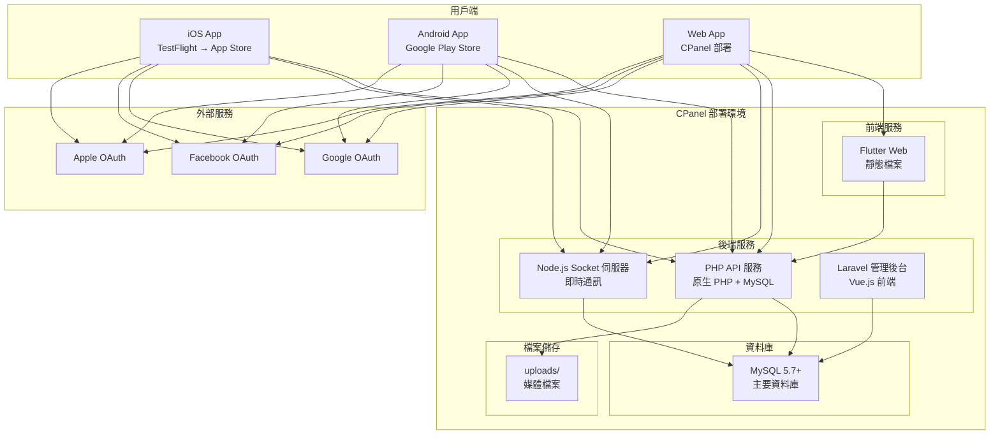
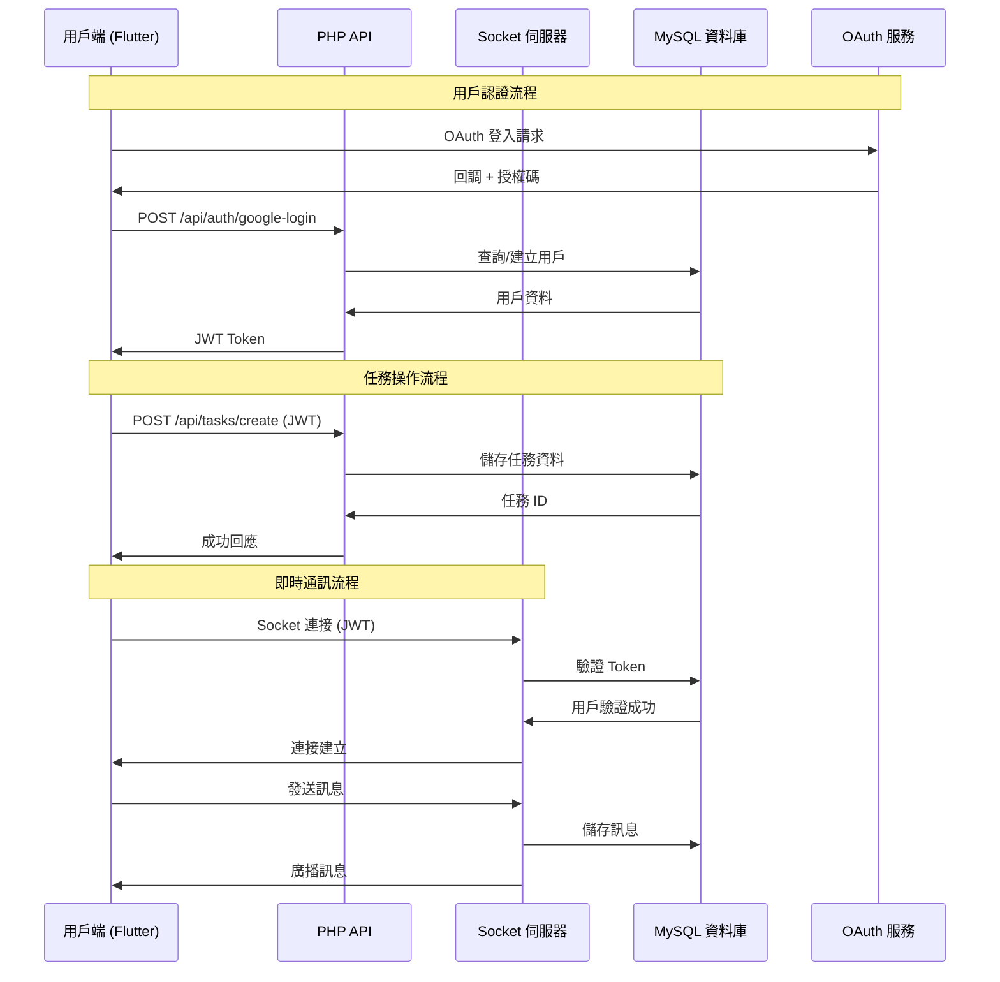
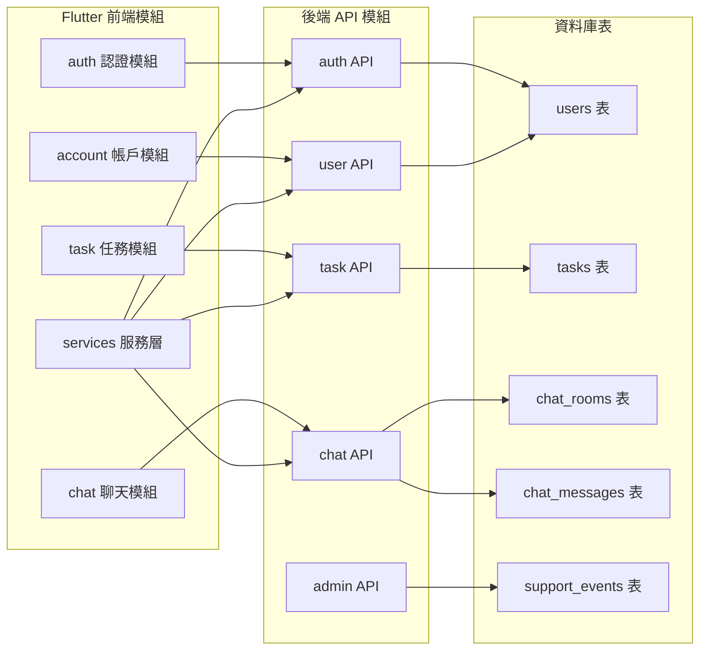

# Here4Help 專案架構概覽

 
> **版本**: 1.9.0+20250915  
> **更新日期**: 2025-09-15

---

## 🏗️ 整體架構

### 系統架構圖



### 技術棧總覽
```
┌─────────────────────────────────────────────────────────────┐
│                    Here4Help 專案架構                        │
├─────────────────────────────────────────────────────────────┤
│ 前端應用 (Flutter)                                          │
│ ├── iOS App (TestFlight → App Store)                       │
│ ├── Android App (Google Play Store)                       │
│ └── Web App (CPanel 部署)                                  │
├─────────────────────────────────────────────────────────────┤
│ 後端服務                                                     │
│ ├── PHP API 服務 (原生 PHP + MySQL)                        │
│ ├── Node.js Socket 伺服器 (即時通訊)                        │
│ └── Laravel 管理後台 (Vue.js 前端)                          │
├─────────────────────────────────────────────────────────────┤
│ 部署環境                                                     │
│ └── CPanel (Basic_H10G-50G-addones)                        │
└─────────────────────────────────────────────────────────────┘
```

---

## 📱 前端架構 (Flutter)

### 開發語言與框架
- **主要語言**: Dart
- **框架**: Flutter 3.3.0+
- **狀態管理**: Provider
- **路由管理**: GoRouter
- **HTTP 客戶端**: http 套件

### 核心模組結構
```
lib/
├── auth/                    # 認證模組
│   ├── models/             # 用戶模型、註冊模型
│   ├── pages/              # 登入、註冊、驗證頁面
│   ├── services/           # 認證服務、第三方登入
│   └── widgets/            # 認證相關組件
├── task/                   # 任務模組
│   ├── models/             # 任務模型
│   ├── pages/              # 任務列表、詳情、發布頁面
│   ├── services/           # 任務 API 服務
│   └── widgets/            # 任務相關組件
├── chat/                   # 聊天模組
│   ├── models/             # 聊天室、訊息模型
│   ├── pages/              # 聊天室頁面
│   ├── services/           # Socket 通訊服務
│   └── widgets/            # 聊天 UI 組件
├── account/                # 帳戶管理
│   ├── pages/              # 個人資料、設定頁面
│   └── models/             # 帳戶相關模型
├── config/                 # 配置管理
│   ├── app_config.dart     # 應用程式配置
│   └── env_config.dart     # 環境變數配置
└── services/               # 共用服務
    ├── api/                # API 客戶端
    ├── socket/             # Socket 連接
    └── media/              # 媒體處理
```

### 主要功能特色
- ✅ OAuth 登入 (Google/Facebook/Apple)
- ✅ 任務發布與應徵系統
- ✅ 即時聊天室 (WebSocket)
- ✅ 學生身份驗證
- ✅ 推薦碼系統
- ✅ 積分和評價系統
- ✅ 多平台支援 (iOS/Android/Web)

---

## 🔧 後端架構

### 1. PHP API 服務 (主要後端)

#### 開發語言與技術
- **主要語言**: PHP 7.4+
- **資料庫**: MySQL 5.7+
- **認證**: JWT Token
- **API 風格**: RESTful

#### 核心模組結構
```
backend/
├── api/                    # API 端點
│   ├── auth/              # 認證相關 API
│   │   ├── login.php      # 登入
│   │   ├── register.php   # 註冊
│   │   └── google-login.php # Google 登入
│   ├── tasks/             # 任務相關 API
│   │   ├── create.php     # 建立任務
│   │   ├── list.php       # 任務列表
│   │   └── update.php     # 更新任務
│   ├── chat/              # 聊天相關 API
│   │   ├── messages.php   # 訊息處理
│   │   └── rooms.php      # 聊天室管理
│   ├── users/             # 用戶管理 API
│   └── admin/             # 管理員 API
├── config/                # 配置檔案
│   ├── database.php       # 資料庫配置
│   ├── cors.php          # CORS 設定
│   └── env.example       # 環境變數範例
├── utils/                 # 工具類別
│   ├── jwt_manager.php    # JWT 管理
│   ├── response.php       # 回應處理
│   └── validation.php     # 資料驗證
└── uploads/               # 檔案上傳目錄
    ├── avatars/           # 頭像
    ├── chat/              # 聊天圖片
    └── student_id_images/ # 學生證圖片
```

### 2. Node.js Socket 伺服器

#### 開發語言與技術
- **主要語言**: JavaScript (Node.js)
- **框架**: Socket.IO
- **用途**: 即時通訊

#### 核心功能
```
backend/socket/
├── server.js              # Socket 伺服器主程式
├── support_events.js      # 客服事件處理
├── notification_handler.php # 通知處理
└── package.json           # Node.js 依賴
```

### 3. Laravel 管理後台

#### 開發語言與技術
- **後端語言**: PHP 8.2+
- **框架**: Laravel 12.0
- **前端語言**: TypeScript
- **前端框架**: Vue.js
- **認證**: Laravel Sanctum

#### 核心功能
```
admin/
├── app/                   # Laravel 應用程式
├── frontend/              # Vue.js 前端
│   ├── src/              # Vue 組件
│   └── package.json      # 前端依賴
├── routes/               # Laravel 路由
├── config/               # Laravel 配置
└── composer.json         # PHP 依賴
```

---

## 🗄️ 資料庫架構

### 主要資料表
- **users**: 用戶基本資料
- **user_identities**: OAuth 身份關聯
- **tasks**: 任務資料
- **task_applications**: 任務應徵
- **chat_rooms**: 聊天室
- **chat_messages**: 聊天訊息
- **support_events**: 客服事件
- **ratings**: 評價系統
- **notifications**: 通知系統

---

## 🚀 部署架構

### CPanel 部署結構
```
public_html/
├── here4help/
│   ├── backend/          # PHP 後端
│   ├── admin/            # Laravel 管理後台
│   └── web/              # Flutter Web 版本
└── socket/               # Node.js Socket 伺服器
```

### 環境配置
- **開發環境**: MAMP/XAMPP
- **測試環境**: CPanel + TestFlight
- **正式環境**: CPanel + App Store/Google Play

---

## 👥 團隊分工建議

### 前端開發 (Flutter)
- **負責範圍**: `lib/` 目錄下所有 Flutter 程式碼
- **技能要求**: Dart, Flutter, Provider, GoRouter
- **主要任務**: UI/UX 開發、狀態管理、API 整合

### 後端開發 (PHP)
- **負責範圍**: `backend/` 目錄下所有 PHP 程式碼
- **技能要求**: PHP, MySQL, JWT, RESTful API
- **主要任務**: API 開發、資料庫設計、認證系統

### Socket 開發 (Node.js)
- **負責範圍**: `backend/socket/` 目錄
- **技能要求**: JavaScript, Node.js, Socket.IO
- **主要任務**: 即時通訊、WebSocket 管理

### 管理後台開發 (Laravel + Vue)
- **負責範圍**: `admin/` 目錄
- **技能要求**: PHP, Laravel, Vue.js, TypeScript
- **主要任務**: 管理員功能、數據統計、系統監控

### DevOps/部署
- **負責範圍**: 部署配置、環境管理
- **技能要求**: CPanel, Apache, MySQL, 環境配置
- **主要任務**: 部署自動化、環境監控、備份管理

---

## 📋 開發規範

### 程式碼規範
- **Flutter**: 遵循 Dart 官方規範
- **PHP**: 遵循 PSR-12 規範
- **JavaScript**: 遵循 ESLint 規範
- **Vue.js**: 遵循 Vue 官方風格指南

### Git 工作流程
- **主分支**: `main` (正式環境)
- **開發分支**: `develop` (測試環境)
- **功能分支**: `feature/功能名稱`
- **修復分支**: `hotfix/修復內容`

### 環境變數管理
- 敏感資訊透過 `.env` 檔案管理
- 不同環境使用不同配置檔案
- 絕不將敏感資訊提交到 Git

---

## 🔄 資料流架構圖

### API 資料流圖



### 模組依賴關係圖



---

20250915
